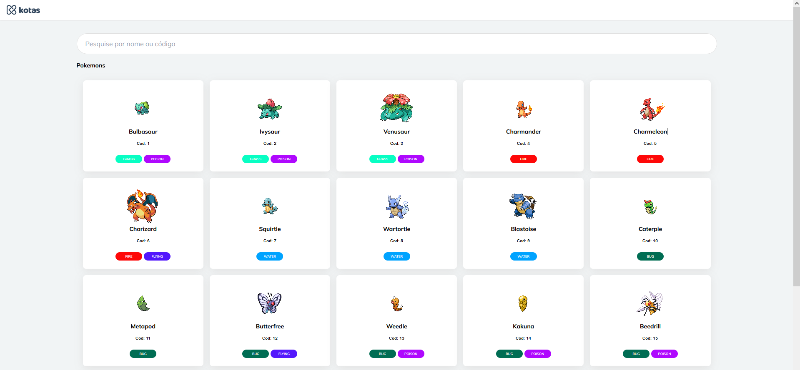

<h1 align="center">
  
</h1>

<h1 align="center">Pokédex</h1>
Uma bela Pokédex para listagem de todos os Pokémons.


### ✨ Features

- Pesquisa simples pelo nome do Pokémon
- Pesquisa pelo código do Pokémon
- Exibição dos detalhes de cada Pokémon

<h1 align="center">
  
</h1>

### ✅ Pré-requisitos

```bash
# node na versão 16.14 ou superior
$ node -v
v16.14.2

# yarn ou npm
$ yarn -v
1.22.18
```

### 🚀 Rodando o projeto

```bash
$ yarn && yarn dev
# ou
$ npm && npm run dev
```

### 💻 Tecnologias

- [Node.js](https://nodejs.org/pt-br/)
- [Vite](https://vitejs.dev/)
- [Tailwindcss](https://tailwindcss.com/)
- [VueJs 2](https://v2.vuejs.org/)
- [Vue-Router](https://router.vuejs.org/)
- [Vuex](https://vuex.vuejs.org/)
